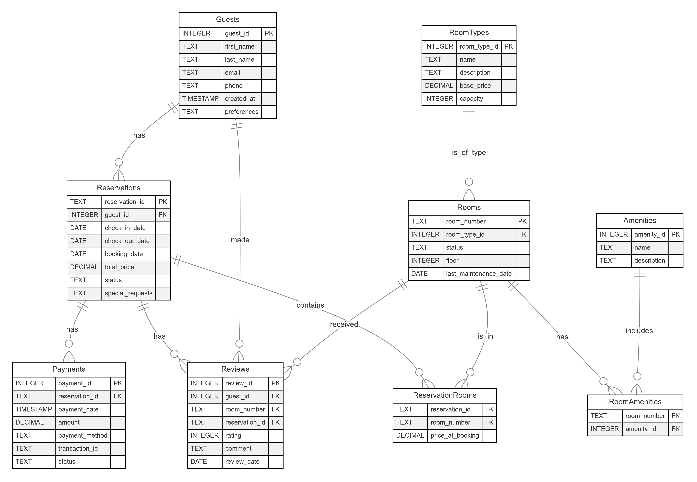

# Diseño de Base de Datos para Reservaciones de Hotel

Este documento describe el diseño de la base de datos utilizada para la gestión de reservaciones en un hotel. La base de datos ha sido implementada en SQLite y cumple con los requisitos de integridad y normalización necesarios para asegurar una correcta administración de la información relacionada con los huéspedes, habitaciones, reservaciones, pagos y otros elementos clave del sistema.

### Diagrama de Entidad y relacion 

## Estructura de Tablas

### 1. Tabla `Guests` (Húespedes)
La tabla Guests almacena la información personal y preferencias de cada huésped.

| Columna       | Tipo         | Restricciones           | Descripción                         |
|---------------|--------------|-------------------------|-------------------------------------|
| `guest_id`    | INTEGER      | PK, AUTOINCREMENT       | ID único del huésped               |
| `first_name`  | TEXT         | NOT NULL                | Nombre                             |
| `last_name`   | TEXT         | NOT NULL                | Apellido                          |
| `email`       | TEXT         | UNIQUE, NOT NULL        | Correo electrónico                |
| `phone`       | TEXT         |                         | Teléfono de contacto              |
| `created_at`  | TIMESTAMP    | DEFAULT CURRENT_TIMESTAMP | Fecha de creación                |
| `preferences` | TEXT         |                         | Preferencias en formato JSON      |

**Relaciones:**
- `guest_id` → `Reservations(guest_id)`
- `guest_id` → `Reviews(guest_id)`

---
### 2. Tabla `RoomTypes` (Tipos de Habitación)
La tabla RoomTypes agrupa las categorías de habitaciones con sus características principales. Sus categoria principales serian Single, Double, Suit, y Familiar. Facilita la definición de precios base y capacidades, para ofrecer opciones de alojamiento adecuadas a cada huésped.

| Columna          | Tipo         | Restricciones    | Descripción                     |
|------------------|--------------|------------------|---------------------------------|
| `room_type_id`   | INTEGER      | PK, AUTOINCREMENT | ID único del tipo de habitación|
| `name`           | TEXT         | NOT NULL         | Nombre (Ej: "Suite Ejecutiva") |
| `description`    | TEXT         |                  | Descripción detallada          |
| `base_price`     | DECIMAL(10,2)| NOT NULL         | Precio base por noche          |
| `capacity`       | INTEGER      | NOT NULL         | Capacidad máxima               |

**Relaciones:**
- `room_type_id` ← `Rooms(room_type_id)` (FK)

---

### 3. Tabla `Rooms` (Habitaciones)
 La tabla Rooms identifica cada habitación física del hotel y sus atributos. Permite gestionar su disponibilidad, estado y características específicas para asignaciones de reserva.

| Columna               | Tipo         | Restricciones                          | Descripción                |
|-----------------------|--------------|----------------------------------------|----------------------------|
| `room_number`         | TEXT         | PK                                    | Identificador único       |
| `room_type_id`        | INTEGER      | FK → `RoomTypes(room_type_id)`        | Tipo de habitación        |
| `status`              | TEXT         | CHECK: 4 valores permitidos           | Estado actual             |
| `floor`               | INTEGER      |                                       | Número de piso           |
| `last_maintenance_date` | DATE       |                                       | Último mantenimiento     |

**Relaciones:**
- `room_number` → `ReservationRooms(room_number)`
- `room_number` → `Reviews(room_number)`
- `room_number` → `RoomAmenities(room_number)`

---
### 4. Tabla `Reservations` (Reservas)
La tabla Reservations registra toda la información de cada reserva: fecha de check-in/check-out, huésped asociado y estado de la reserva. Es el eje principal para vincular datos de habitación, facturación y reseñas.

| Columna            | Tipo         | Restricciones                          | Descripción              |
|--------------------|--------------|----------------------------------------|--------------------------|
| `reservation_id`   | TEXT         | PK                                    | ID único formato custom |
| `guest_id`         | INTEGER      | FK → `Guests(guest_id)`               | Huésped asociado        |
| `check_in_date`    | DATE         | NOT NULL                              | Fecha de entrada        |
| `check_out_date`   | DATE         | NOT NULL                              | Fecha de salida         |
| `booking_date`     | DATE         | DEFAULT (DATE('now'))                 | Fecha de reserva        |
| `total_price`      | DECIMAL(10,2)| NOT NULL                              | Precio total            |
| `status`           | TEXT         | CHECK: 5 estados permitidos           | Estado de reserva       |
| `special_requests` | TEXT         |                                       | Notas adicionales       |

**Relaciones:**
- `reservation_id` → `ReservationRooms(reservation_id)`
- `reservation_id` → `Payments(reservation_id)`
- `reservation_id` → `Reviews(reservation_id)`

---

### 5. Tabla `ReservationRooms` (Habitaciones por Reserva)
La tabla ReservationRooms hace posible que una reserva incluya múltiples habitaciones o que una habitación forme parte de varias reservas en diferentes periodos

| Columna            | Tipo         | Restricciones                          | Descripción              |
|--------------------|--------------|----------------------------------------|--------------------------|
| `reservation_id`   | TEXT         | FK → `Reservations(reservation_id)`    | ID Reserva              |
| `room_number`      | TEXT         | FK → `Rooms(room_number)`              | Habitación asignada     |
| `price_at_booking` | DECIMAL(10,2)| NOT NULL                              | Precio histórico        |

**Clave Primaria Compuesta:** (`reservation_id`, `room_number`)

---
### 6. Tabla `Payments` (Pagos)
La tabla Payments gestiona los pagos realizados por cada reserva, registrando el método de pago, montos y el estado de la transacción.

| Columna          | Tipo         | Restricciones                          | Descripción              |
|------------------|--------------|----------------------------------------|--------------------------|
| `payment_id`     | INTEGER      | PK, AUTOINCREMENT                     | ID único                |
| `reservation_id` | TEXT         | FK → `Reservations(reservation_id)`    | Reserva asociada        |
| `payment_date`   | TIMESTAMP    | DEFAULT CURRENT_TIMESTAMP             | Fecha de pago          |
| `amount`         | DECIMAL(10,2)| NOT NULL                              | Monto pagado           |
| `payment_method` | TEXT         | CHECK: 3 métodos permitidos           | Forma de pago          |
| `transaction_id` | TEXT         |                                       | ID Transacción externa |
| `status`         | TEXT         | CHECK: 3 estados permitidos           | Estado del pago        |

---
### 7. Tabla `Reviews` (Reseñas)
La tabla Reviews permite a los huéspedes dejar retroalimentación sobre sus experiencias en el hotel, vinculándolas con la reserva e información de la habitación.
| Columna          | Tipo     | Restricciones                         | Descripción                         |
|------------------|----------|---------------------------------------|-------------------------------------|
| `review_id`      | INTEGER  | PK, AUTOINCREMENT                     | ID único de la reseña              |
| `guest_id`       | INTEGER  | FK → `Guests(guest_id)`               | Huésped que realiza la reseña     |
| `room_number`    | TEXT     | FK → `Rooms(room_number)`             | Habitación evaluada                |
| `reservation_id` | TEXT     | FK → `Reservations(reservation_id)`   | Reserva asociada                   |
| `rating`         | INTEGER  | CHECK (1-5)                           | Calificación entre 1 y 5           |
| `comment`        | TEXT     |                                       | Comentario adicional               |
| `review_date`    | DATE     | DEFAULT (DATE('now'))                 | Fecha en que se hizo la reseña     |

---
### 8. Tabla `Amenities` (Amenidades)

define las amenidades disponibles en el hotel, como ejemplo, wifi, TV, minibar, Spa, Desayuno.. etc 

| Columna        | Tipo     | Restricciones            | Descripción                         |
|----------------|----------|--------------------------|-------------------------------------|
| `amenity_id`   | INTEGER  | PK, AUTOINCREMENT        | ID único de la amenidad            |
| `name`         | TEXT     | NOT NULL                 | Nombre de la amenidad              |
| `description`  | TEXT     |                          | Descripción de la amenidad         |

---
### 9. Tabla `RoomAmenities` (Amenidades por Habitación)

La tabla RoomAmenities asocia cada habitación con las amenidades que ofrece, permitiendo gestionar qué servicios están disponibles en cada espacio.

| Columna        | Tipo     | Restricciones                         | Descripción                         |
|----------------|----------|---------------------------------------|-------------------------------------|
| `room_number`  | TEXT     | FK → `Rooms(room_number)`             | Número de habitación               |
| `amenity_id`   | INTEGER  | FK → `Amenities(amenity_id)`          | ID de la amenidad incluida         |

**Clave Primaria Compuesta:** (`room_number`, `amenity_id`)

---

